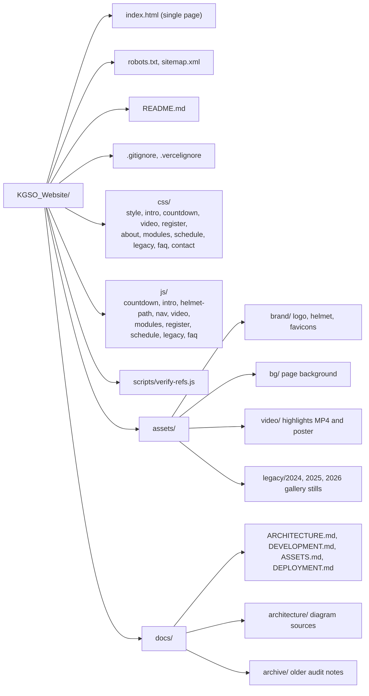

# Repository structure

```mermaid
flowchart LR
  root["KGSO_Website/"]
  root --> index["index.html (single page)"]
  root --> seo["robots.txt, sitemap.xml"]
  root --> readme["README.md"]
  root --> ignores[".gitignore, .vercelignore"]
  root --> css["css/<br/>style, intro, countdown, video, register,<br/>about, modules, schedule, legacy, faq, contact"]
  root --> js["js/<br/>countdown, intro, helmet-path, nav, video,<br/>modules, register, schedule, legacy, faq"]
  root --> scripts["scripts/verify-refs.js"]
  root --> assets["assets/"]
  root --> docs["docs/"]
  assets --> brand["brand/ logo, helmet, favicons"]
  assets --> bg["bg/ page background"]
  assets --> video["video/ highlights MP4 and poster"]
  assets --> legacy["legacy/2024, 2025, 2026 gallery stills"]
  docs --> arch["ARCHITECTURE.md, DEVELOPMENT.md, ASSETS.md, DEPLOYMENT.md"]
  docs --> diagrams["architecture/ diagram sources"]
  docs --> archive["archive/ older audit notes"]
```
