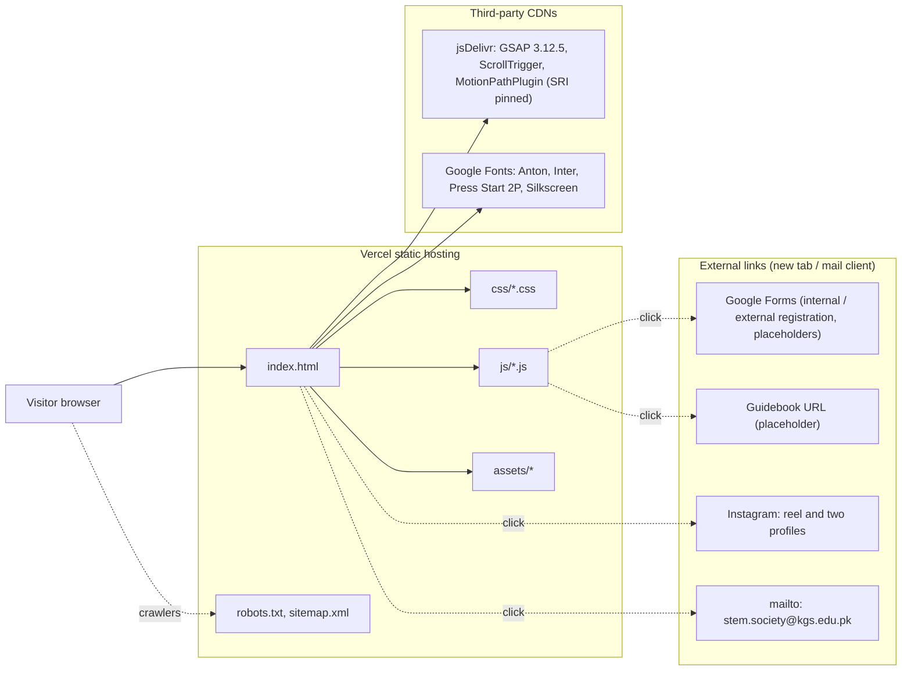

# System architecture

Static site: the browser loads files from the host and a few third-party CDNs. No backend, database, API or build step.

```mermaid
flowchart LR
  user["Visitor browser"]
  subgraph host["Vercel static hosting"]
    html["index.html"]
    css["css/*.css"]
    js["js/*.js"]
    assets["assets/*"]
    seo["robots.txt, sitemap.xml"]
  end
  subgraph cdn["Third-party CDNs"]
    gsap["jsDelivr: GSAP 3.12.5, ScrollTrigger, MotionPathPlugin (SRI pinned)"]
    fonts["Google Fonts: Anton, Inter, Press Start 2P, Silkscreen"]
  end
  subgraph ext["External links (new tab / mail client)"]
    forms["Google Forms (internal / external registration, placeholders)"]
    guide["Guidebook URL (placeholder)"]
    insta["Instagram: reel and two profiles"]
    mail["mailto: stem.society@kgs.edu.pk"]
  end
  user --> html
  html --> css
  html --> js
  html --> assets
  html --> gsap
  html --> fonts
  user -. crawlers .-> seo
  js -. click .-> forms
  js -. click .-> guide
  html -. click .-> insta
  html -. click .-> mail
```
